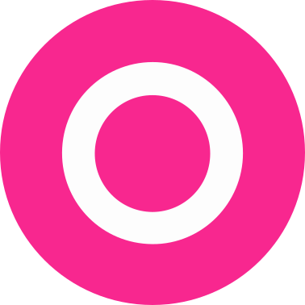
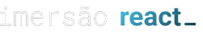

<h1 align="center">
  
</h1>

## **<h2 align="center">Front end application  💻</h2>**

## 
<h2 align="center">A retro app based on Orkut developed at #ImersãoReact delivered by [Alura](https://www.alura.com.br/imersao-react)</h2> 

### 
  

  <a href="#computer-demonstration-of-the-application-web">Demonstration of the application</a>&nbsp;&nbsp;&nbsp;|&nbsp;&nbsp;&nbsp;
  <a href="#rocket-technologies-used">Technologies used</a>&nbsp;&nbsp;&nbsp;|&nbsp;&nbsp;&nbsp;
  <a href="#information_source-application-installation">Application installation</a>

# :computer: Demonstration of the application Web

  

 

# **Demonstration of the application - Mobile Layout** 📱

  

 

<h3 align="center"> 
	 Application status: Finalized ✔️
</h3>

 

<h3 align="center">
   In addition to developing the initial application offered in the classes, I added more features to the application, such as:
</h3>

###
* Requests made through the server side using gerServerSideProps
* List of friends brought from Github (followers)
* Communities listing already created
* Changes in project structure
* Small additions in stylizations
* Form validations, image url validation
* Visual feedback to the user
* Logout of the app
* Adding typing with TypeScript

<h2 align="center"> 
	Web application: https://alurakut-mathwcruz.vercel.app/
</h2>
 

## :star: Features
- [x] Log in to the app through a Github account
- [x] Create a community
- [x] List of friends brought from Github (followers)
- [x] Communities listing already created
- [x] Authentication with own API

 

## :rocket: Technologies used:

 

## :information_source: Application installation
- `git clone https://github.com/mathwcruz/alurakut.git` to clone the repository

 

# 🎲 Run application
To run the application on the web, follow the instructions from your terminal:
- `cd alurakut` and `code .`
- run `yarn` to install the dependencies of the project
- Run `yarn dev` to run the application, will open at the address `localhost:3000`

 

### Author
---

<a href="https://app.rocketseat.com.br/me/matheus-da-cruz-frontend">
 
  
 <b>Matheus da Cruz</b></a> <a href="https://app.rocketseat.com.br/me/matheus-da-cruz-frontend" title="Rocketseat">  🚀</a>

 

 

### 
 <h2 align="center">Another application developed by Matheus da Cruz 👨‍💻 </h2> 

